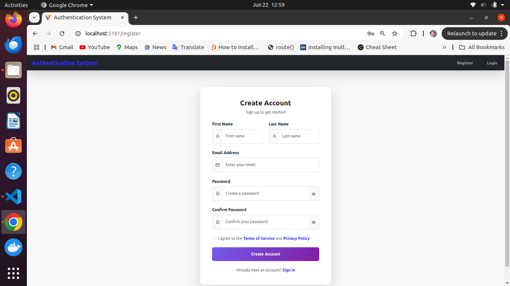
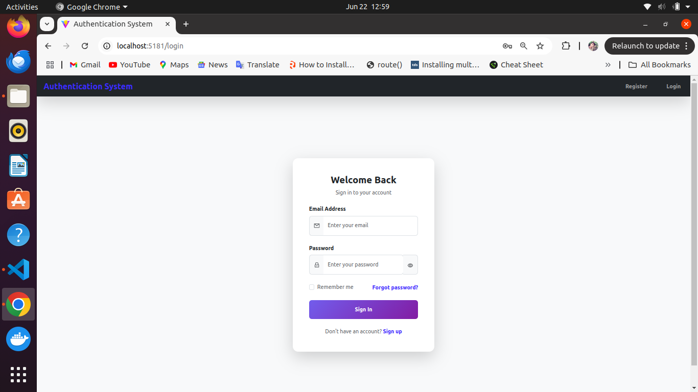
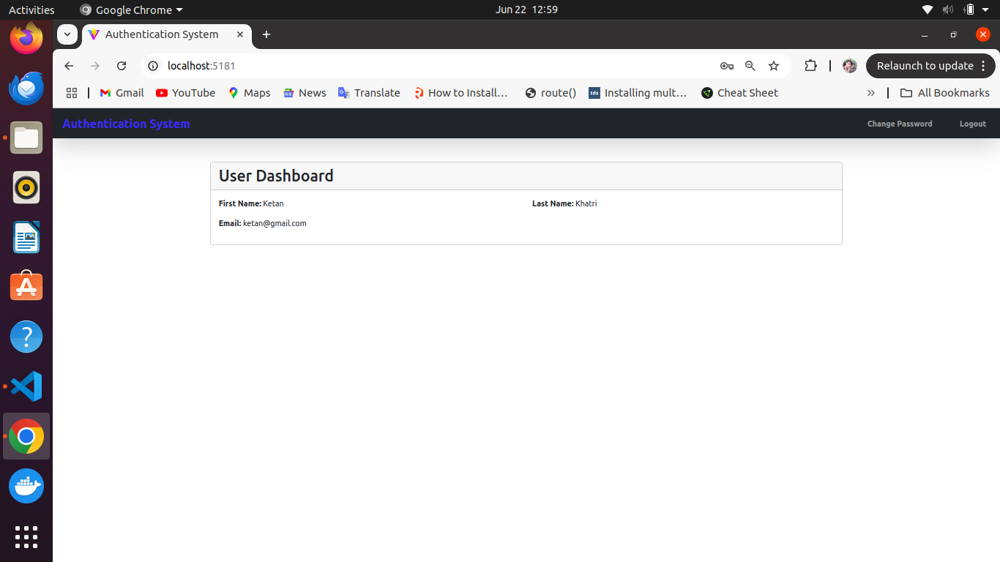
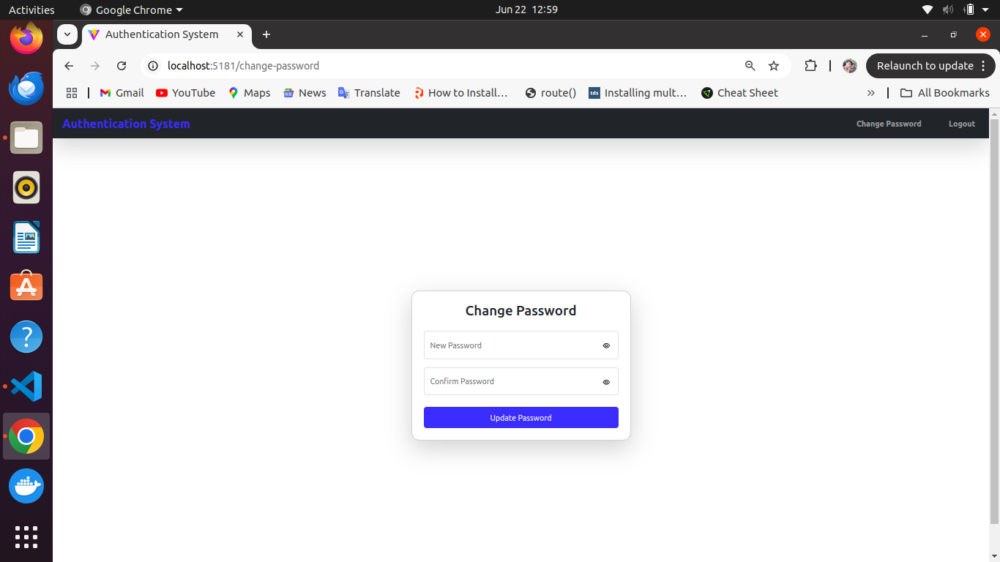
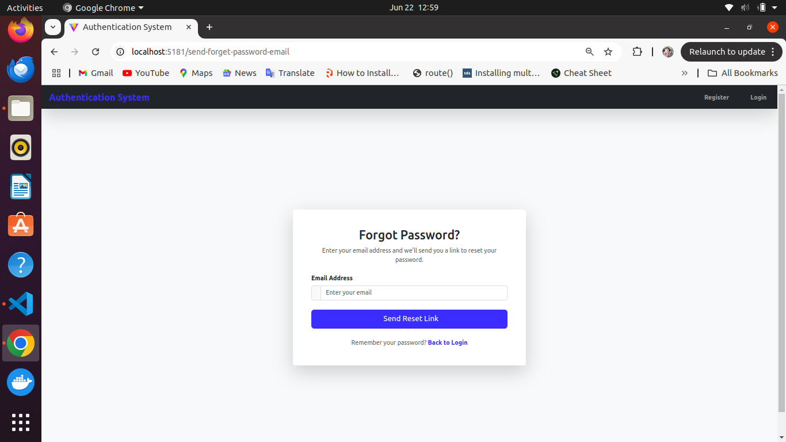
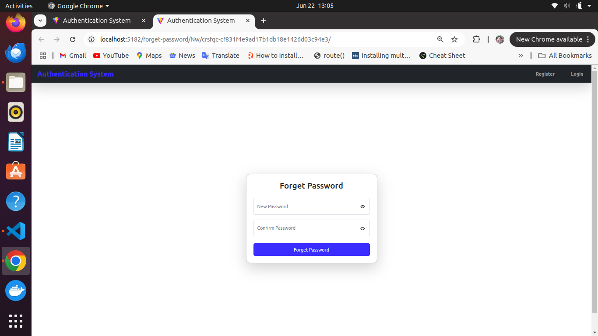

# 🔐 Authentication System

A full-featured authentication system with clean UI and essential functionalities.

## 🛠️ Tech Stack

### Frontend

- ReactJS
- Axios
- react-router-dom
- Bootstrap
- React Toastify

### Backend

- Django
- Django REST Framework
- Simple JWT (Token Authentication)
- Django CORS Headers
- SMTP Email Setup for Password Reset

## 🔗 API Endpoints

### 🔐 Authentication

- `POST /api/user/register/` – Register a new user
- `POST /api/user/login/` – Login user and return JWT tokens
- `POST /api/user/token/refresh/` – Refresh access token
- `GET  /api/user/profile/` – Retrieve authenticated user's profile
- `POST /api/user/changepassword/` – Change password (authenticated users only)

### 🔄 Password Reset

- `POST /api/user/send-reset-password-email/` – Send password reset link via console
- `POST /api/user/reset-password/<uid>/<token>/` – Reset password using UID and token

## 🔧 Setup Instructions

### Backend (Django)

```bash
cd backend
python -m venv env
source env/bin/activate
pip install -r requirements.txt
python manage.py migrate
python manage.py runserver
```

## 🌟 Features

### ✅ User Registration

- **Form Fields**: First Name, Last Name, Email, Password, Confirm Password
- **Validation**: All fields required; password match enforced
- **Extras**: Checkbox to agree with Terms of Service and Privacy Policy
- **Navigation**: Link to Sign In if already registered

  

### 🔓 User Login

- **Form Fields**: Email, Password
- **Options**: "Remember me" checkbox
- **Extras**: "Forgot Password?" link
- **Navigation**: Link to Sign Up for new users

  

### 🧑‍💻 User Dashboard

- Displays logged-in user's **First Name**, **Last Name**, and **Email**
- **Navigation**: Options to change password or logout

  

### 🔁 Change Password

- **Form Fields**: New Password, Confirm Password
- **Validation**: Password confirmation required

  

### 📧 Forgot Password (Request Reset)

- **Form Fields**: Email
- **Function**: Sends a password reset link to the provided console(terminal)
- **Navigation**: Link to go back to Login page

  

### 🔑 Reset Password (via Reset Link)

- Accessed through a tokenized link
- **Form Fields**: New Password, Confirm Password
- **Validation**: Password confirmation required

  
